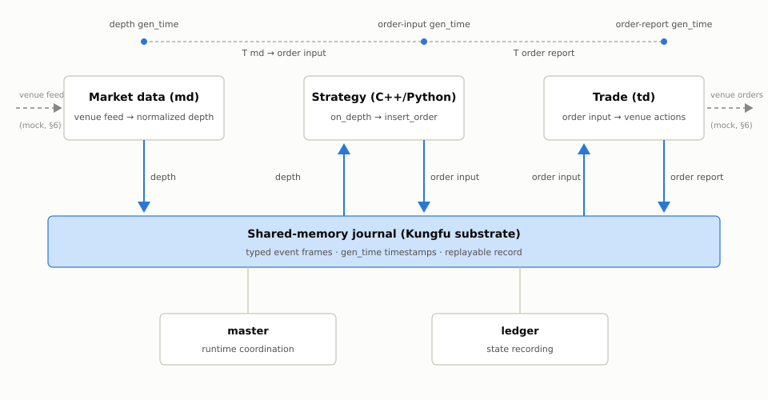
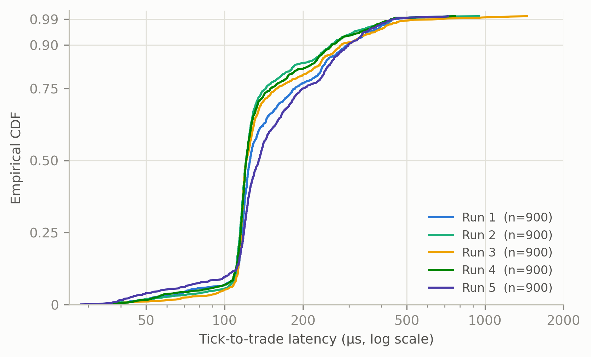

# Low-Latency Execution Infrastructure for Cross-Exchange Funding Rate Arbitrage in Cryptocurrency Markets

**Kun Xue**  
Godzilla Foundation  

## Abstract

Funding-rate arbitrage captures periodic payments between perpetual-futures and offsetting spot or derivatives positions. Although the economic signal is conceptually simple, execution quality depends on how quickly a system can observe market-data changes, make a decision, and submit a hedge or quote before the basis moves. This paper presents godzilla.dev, an open-source, self-hosted C++/Python framework for funding-rate arbitrage, market making, and other latency-sensitive cryptocurrency strategies. The framework separates market data, strategy, and trade execution into independently managed processes connected by a shared-memory event journal. We describe this process model, the event-sourced data path, the C++/Python boundary, and a deterministic local benchmark for measuring software-stack tick-to-trade latency without network or exchange-engine noise. On a 13th-generation Intel Core i7-1360P, five native C++ benchmark runs produced a mean-of-run p50 of 124.9 microseconds, p90 of 278.0 microseconds, p99 of 485.9 microseconds, and p99.9 of 821.1 microseconds over 4,500 measured order cycles. These results characterize one controlled local configuration; they do not measure exchange latency, fill quality, profitability, or production reliability. The benchmark scripts, journal-derived event records, and analysis tools are included in the project repository to support independent reproduction.

## 1. Introduction

Perpetual futures use periodic funding transfers to help keep contract prices near their underlying reference markets [1]. A funding-rate arbitrageur typically offsets a perpetual position with spot or another derivative, seeking to receive funding while limiting directional exposure. The signal is transparent, but implementation is not trivial: both legs must be established, maintained, and unwound while prices, available liquidity, funding expectations, and venue conditions change.

Execution infrastructure therefore matters even when the strategy is not an ultra-short-horizon alpha strategy. A delayed quote can become stale, a delayed hedge can create unintended exposure, and a slow response during basis compression can consume the expected funding return. Internet latency and exchange matching are important, but the software path controlled by the operator is also material: market-data decoding, inter-process transfer, strategy dispatch, order construction, and execution routing all consume time.

Existing open-source trading systems tend to optimize for different objectives. Connector-rich bot frameworks emphasize venue coverage, strategy templates, and ease of use. Proprietary low-latency stacks emphasize deterministic execution but are expensive to build and difficult to audit. godzilla.dev targets the space between them: open-source C++/Python infrastructure for self-hosted crypto funding-rate arbitrage and latency-critical market making.

This paper makes four contributions:

1. It describes a process-isolated market-data, strategy, and trade architecture connected through a journal-based shared-memory event path.
2. It explains how native execution components and Python strategy interfaces coexist without requiring Python in the measured native hot path.
3. It defines a reproducible journal-only tick-to-trade benchmark whose timestamps are extracted from the framework's own event records rather than synchronous trace files.
4. It reports repeated-run latency distributions and explicitly separates software-stack measurements from network, matching-engine, fill, and profitability claims.

## 2. Background and Related Work

### 2.1 Funding-rate arbitrage and execution constraints

A simplified funding trade holds opposite delta exposures across two instruments. If the perpetual leg pays funding to the held side, the expected gross return over a funding interval can be written as

\[
R_{gross} = N \cdot f,
\]

where \(N\) is the hedged notional and \(f\) is the realized funding rate. The net result must also account for basis movement, fees, slippage, borrow or capital costs, incomplete hedges, and operational failures:

\[
R_{net} = R_{gross} - C_{fees} - C_{slippage} - C_{capital} + R_{basis} - C_{execution\ risk}.
\]

He, Manela, Ross, and von Wachter derive no-arbitrage prices for perpetual futures in frictionless markets and bounds under trading costs, and document that deviations from these prices in cryptocurrency markets are larger than in traditional currency markets [1]. Makarov and Schoar document large, persistent cross-exchange price deviations in cryptocurrency markets and attribute part of their persistence to execution and capital-mobility frictions [2]. The decomposition above is the operator-side view of the same frictions: it explains why an apparently delta-neutral trade remains execution-sensitive. The system must coordinate legs and manage partial fills, stale prices, rejected orders, and venue degradation. Low internal latency cannot guarantee profitability, but excessive and variable internal latency increases the interval during which the intended hedge and the actual portfolio differ.

### 2.2 Open-source trading frameworks

Hummingbot is a widely used open-source Python framework with broad centralized- and decentralized-exchange connectivity and ready-made strategy workflows [3]. Those are distinct design strengths. godzilla.dev instead focuses on latency-critical, self-hosted execution with a native core and a journal-oriented process model. This paper does not present a cross-framework comparison; a fair comparison requires version-pinned implementations, identical event streams and strategy semantics, disclosed configuration, and community review of both setups.

The market-design literature documents the economic stakes of the latency race itself [4]. On the engineering side, low-latency trading-system practice emphasizes bounded work in hot paths, pre-allocation, cache locality, clock discipline, and explicit handling of tail latency; the LMAX Disruptor is a well-known published example of replacing queue-based inter-thread handoff with a pre-allocated ring structure for exactly these reasons [5], and the journal design used here belongs to the same family of memory-mapped, single-writer event structures. The present work applies those principles to an open-source cryptocurrency execution framework and contributes a repository-local method for auditing event-to-order timing.

## 3. System Architecture

### 3.1 Process model

The runtime separates responsibilities into market-data (`md`), strategy, and trade (`td`) processes (Figure 1). The market-data process converts venue-specific input into normalized events. The strategy subscribes to those events and emits normalized order requests. The trade process translates requests into venue actions and publishes order state changes. Master and ledger services provide runtime coordination and state recording.

**Figure 1. Process model and journal-based event path.** The md, strategy, and td processes communicate only through the shared-memory journal; master and ledger provide coordination and state recording. The dashed timeline marks the journal `gen_time` timestamps used for the latency decomposition in Section 3.3. In the benchmark of Section 6, the venue endpoints are native mocks.

The separation is operational as well as architectural. A connector can be restarted without embedding venue code in every strategy; strategy failures do not have to corrupt the market-data parser; and order state can be reconstructed from recorded events. In the benchmark used here, the same boundaries are retained while external sockets are removed so that the measurement isolates the local software path.

### 3.2 Shared-memory journal

Processes exchange typed event frames through the Kungfu journal substrate [6]. Kungfu is an open-source trading framework published under the Apache License 2.0; godzilla.dev reuses its journal layer under the same license and builds the connector, strategy, and benchmark layers described in this paper on top of it. Each relevant frame carries generation and trigger timestamps together with source and destination identities. A consumer subscribes to the journal locations it needs, while the recorded stream remains available for later inspection and replay.

This design serves two roles. In live operation, it is the inter-process transport and event record. In evaluation, it supplies timestamps for market depth, order input, and order report frames. The benchmark therefore disables CSV tracing in the hot path and reconstructs latency after the run from journal data. This avoids synchronous formatting and file I/O in the path being measured.

The current paper uses the term *journal-based shared-memory path* deliberately. A stronger formal claim such as wait-free or lock-free for every operation requires a separate proof and implementation audit and is outside this evaluation.

### 3.3 Event path and latency decomposition

The measured path is:

\[
Depth_{md} \rightarrow Strategy \rightarrow OrderInput_{strategy} \rightarrow TD \rightarrow OrderReport_{td}.
\]

For a matched event cycle, the analyzer computes

\[
T_{md\rightarrow order\ input} = t_{order\ input}^{gen} - t_{depth}^{gen},
\]

\[
T_{order\ report} = t_{order\ report}^{gen} - t_{order\ input}^{gen},
\]

and

\[
T_{tick\rightarrow trade} = t_{order\ report}^{gen} - t_{depth}^{gen}.
\]

The first interval includes journal delivery, strategy callback dispatch, price and side selection, order construction, and publication of the order input. The second includes trade-process consumption and generation of a local order report. The total is an end-to-end local software measurement. It does not include packet reception, exchange protocol parsing, an Internet or colocated network hop, exchange matching, or a fill.

### 3.4 C++/Python boundary

The framework exposes strategy lifecycle and market events through pybind11, allowing Python strategies to use the native runtime while retaining rapid iteration. For latency-sensitive components, strategies can implement the same interface in C++. The benchmark strategy used in Section 6 is native C++: its `on_depth` callback selects one side, chooses the corresponding best price, and calls `insert_order`. Python remains in the process bootstrap and module-loading environment but is not used to execute the measured callback logic.

This is a practical boundary rather than a claim that all strategies should be native. Research, orchestration, and low-frequency controls often benefit more from Python productivity than from microsecond-scale response. Components should move into C++ only when measurement shows that they are on a latency-critical path.

### 3.5 Deployment model

The intended latency-sensitive topology is a self-hosted single machine placed near the relevant venue endpoints. CPU affinity may be assigned separately to master, ledger, market-data, trade, and strategy processes. Keeping these roles on one host allows shared-memory communication and avoids adding a service-network hop between the market event and order request.

Containers remain useful for packaging and non-critical services, but this paper does not quantify container overhead. The reported experiment runs directly on the host. Deployment choices should be evaluated on the target kernel, CPU topology, power policy, and venue location rather than inferred from the local benchmark.

## 4. Strategy Layer

Strategies receive normalized callbacks such as startup, depth, order, and trade events. During startup, a strategy registers accounts and market-data subscriptions. During execution, it derives actions from normalized events and submits orders through the context interface. Order and trade callbacks then drive inventory and lifecycle state.

A production funding-rate strategy adds controls that are intentionally absent from the microbenchmark: funding-rate validation, basis monitoring, coordinated leg sizing, partial-fill handling, retry and rejection policy, inventory limits, and emergency unwind behavior. A production market maker similarly needs quote aging, cancel/replace policy, inventory skew, throttling, and self-trade prevention. Publishing operational thresholds or expected returns is outside the scope of this paper.

The benchmark strategy is purposefully smaller. For each accepted depth event, it alternates between buy and sell, selects the displayed best price for that side, constructs one limit order, and stops after 1,000 orders. This minimizes strategy-dependent computation and measures runtime transport and dispatch rather than alpha logic.

## 5. Production Experience

godzilla.dev has been used for self-hosted liquidity provision, inventory hedging, and cross-market arbitrage in production at a top-10 centralized derivatives exchange by trading volume. Beyond that venue class, no venue-identifying details, launch dates, pair lists, capital figures, strategy parameters, or performance data are disclosed, and no production performance claim is asserted as a finding of this paper. The production background is offered as context for the architectural choices described above: restartable venue adapters, explicit order state, replayable event history, and separation between strategy decisions and exchange-specific execution all originate as responses to recurring operational situations rather than as abstract design preferences.

Four categories of operational experience shaped the design:

**Journal recovery.** Because the journal is simultaneously the inter-process transport and the durable event record, recovering a stopped or crashed process reduces to replaying recorded frames rather than reconstructing in-memory state ad hoc. The practical consequence is that recovery is a rehearsable procedure with a defined data source, and post-incident analysis can operate on the same records the system itself used.

**Exchange API degradation.** Venue connectivity degrades partially far more often than it fails outright: elevated reject rates, delayed order reports, stale or gapping depth. Isolating each venue adapter in its own process allows a degraded connector to be restarted or replaced without stopping strategies or other connectors, while the recorded event stream preserves the degradation window for later inspection.

**Clock discipline.** Event ordering and all latency accounting rely on journal timestamps. Operationally this makes local clock stability a first-class concern: step adjustments from time-synchronization daemons and cross-host comparisons of un-synchronized clocks both produce misleading records. The single-host deployment model in Section 3.5 keeps the measured path inside one clock domain by construction.

**Reconciliation after restart.** During any restart window, local order state and venue order state can diverge. The journal defines precisely what the system believed before the restart; a safe resume procedure queries venue open orders and positions and reconciles them against journal-derived state before the strategy is permitted to trade again. Explicit order-state events make this reconciliation mechanical instead of interpretive.

## 6. Evaluation

### 6.1 Research question and scope

The experiment asks: under a controlled, single-host, journal-only configuration, how long does the framework take to transform a synthetic top-of-book event into a locally acknowledged order report?

This is a software-stack microbenchmark. It does not measure:

- strategy profitability or funding capture;
- fill probability, queue position, or market impact;
- exchange matching-engine or gateway latency;
- Internet or colocation network latency;
- connector coverage, usability, or community support;
- long-duration stability under production load.

### 6.2 Experimental setup

The experiment was run from a working tree based on repository commit `5b9cee052591fc77b03925fbe8500632ebc8eaaa`. The benchmark implementation was already present in that revision's history. The complete 32-file result artifact, including raw journal exports, per-event joined latency records, per-run summaries, and aggregate summaries, is published in commit `da9dd09839c6ce16ab73b1a7a11ae1b5ed4e9349`. The host configuration was:

| Item | Configuration |
| --- | --- |
| CPU | Intel Core i7-1360P, 12 cores / 16 logical CPUs |
| Cache | 18 MiB L3 |
| Operating system | Linux 6.14.0-37-generic, x86-64 |
| Runtime topology | master, ledger, native mock MD, native mock TD, native C++ strategy |
| CPU affinity | master=0, ledger=1, MD=2, TD=3, strategy=4 |
| Market-data interval | 300,000 ns |
| MD wait policy | sleep followed by a 100,000 ns spin window |
| Trace mode | journal only; benchmark CSV tracing disabled |
| Input per run | 5,000 depth events |
| Orders per run | 1,000 |
| Warm-up exclusion | first 100 matched cycles |
| Measured samples | 900 per run, 4,500 total |
| Repetitions | 5 |

The host is a commodity laptop-class CPU rather than a tuned server platform. The reported numbers should therefore be read as a conservative baseline for the software stack: a co-located server with an isolated and tuned kernel, fixed frequency policy, and controlled thermal envelope represents a different — and generally more favorable — operating point that is not measured here.

The exact compiler version, build flags, CPU governor, memory configuration, and background workload were not captured in the existing result artifacts. These fields must be recorded before the final submission because they can materially affect tail latency.

The reproducible command is documented in `scripts/benchmark/README.md`. Each run stops existing benchmark services, clears prior journals and traces, starts the pinned processes, waits for the finite event stream to drain, stops the processes, and analyzes the resulting journals.

### 6.3 Event matching and measurement integrity

Each run generated 5,000 depth frames and 1,000 order-input and order-report frames. The analyzer matched depth to order input by `(symbol, side, price)` and matched order input to report by `order_id`. All 1,000 order cycles in every run were matched using these primary keys; no time-based fallback and no unmatched order were reported. The first 100 cycles were excluded, leaving 900 observations per run.

Journal frame `gen_time` is the common time basis. Because all measured processes run on one host, the timestamps share one system clock domain. The results still include scheduler activity, journal transport, process wake-up, callback dispatch, and local trade-path work. They should not be interpreted as isolated function-call timing.

### 6.4 Results

Figure 2 shows the empirical distribution of end-to-end tick-to-trade latency for each of the five runs. Table 1 reports the mean of each per-run percentile, together with the minimum and maximum percentile observed across the five runs. Values are in microseconds.

**Figure 2. Per-run empirical CDFs of end-to-end tick-to-trade latency** (log-scale x-axis; 900 post-warm-up observations per run). The five runs are closely aligned through the median region and diverge in the upper tail, which motivates reporting repeated-run percentiles rather than a single best run. Between five and ten percent of cycles in each run complete in under 100 microseconds; attributing these fast cycles to a specific scheduling mechanism would require instrumentation not present in this experiment.

**Table 1. Repeated-run tick-to-trade latency.**

| Percentile | Minimum run | Mean across runs | Maximum run |
| --- | ---: | ---: | ---: |
| p50 | 121.1 | 124.9 | 135.4 |
| p90 | 256.0 | 278.0 | 298.6 |
| p99 | 434.8 | 485.9 | 662.0 |
| p99.9 | 703.8 | 821.1 | 1,267.9 |

The mean of the per-run arithmetic means was 161.5 microseconds. Run-level maxima ranged from 719.9 to 1,450.0 microseconds. We do not use the arithmetic mean as the headline statistic because latency distributions are asymmetric and the tail is operationally important.

Table 2 decomposes the same measurement into market-data-to-order-input and order-input-to-order-report stages. Values are means of per-run percentiles in microseconds.

**Table 2. Mean per-run latency percentiles by stage.**

| Stage | p50 | p90 | p99 | p99.9 |
| --- | ---: | ---: | ---: | ---: |
| MD generation to order-input generation | 100.0 | 147.6 | 335.6 | 580.9 |
| Order-input generation to order-report generation | 26.3 | 131.5 | 206.5 | 450.7 |
| End-to-end tick to local order report | 124.9 | 278.0 | 485.9 | 821.1 |

The median is dominated by the MD-to-order-input stage. At higher percentiles, both stages contribute scheduler and process-wakeup variability. One run exhibited a 1.334 ms order-report-stage maximum and consequently the highest end-to-end p99 and p99.9. This illustrates why a single best run would overstate predictability.

The reported percentile aggregation is the mean of five run-specific percentiles, not a percentile over a pooled 4,500-row sample and not a median of run medians. The repository also preserves per-event joined CSV files, enabling pooled or alternative statistical analyses.

### 6.5 Interpretation

The experiment supports a narrow conclusion: in this host configuration, the native journal-only path usually converted a synthetic depth update into a local order report in substantially less than one millisecond, with a mean-of-run median of approximately 125 microseconds. It also shows non-negligible tail excursions. The experiment does not establish a universal latency bound, a production service-level objective, or superiority over another framework.

The 300-microsecond input interval is a workload parameter, not the measured target. Events arrive at approximately 3,333 updates per second, while the strategy emits only the first 1,000 orders from a 5,000-event stream. Future evaluations should measure sustained workloads, burst arrival patterns, queue depth, dropped events, and thermal behavior over longer runs.

## 7. Limitations and Future Work

The evaluation has several limitations. First, five runs and 4,500 retained observations are sufficient for an initial engineering baseline but weak for estimating extreme percentiles. A publication run should follow the predeclared protocol of warm-up runs plus at least 30 measured repetitions and should report confidence intervals.

Second, synthetic constant-rate depth updates do not reproduce clustered arrivals, message-size variation, or exchange-specific parsing. Recorded top-of-book replay and compressed burst datasets should be added. Third, the current benchmark bypasses network sockets and exchange protocols. That is intentional for isolating the software path, but a separate reference testnet experiment is needed to characterize end-to-end deployment behavior.

Fourth, the benchmark uses a native C++ strategy and native mock components. A Python strategy result would answer a different and practically important question: the cost of retaining Python in the callback path. It should be reported separately rather than blended with the native result.

Fifth, this draft does not compare frameworks. A future v2 study may compare godzilla.dev and Hummingbot using pinned versions, identical replay data, equivalent strategy semantics, identical mock endpoints, disclosed configurations, and external review of the Hummingbot setup. Such a comparison should acknowledge connector breadth and usability as separate dimensions not captured by tick-to-trade latency.

Finally, the framework's single-host shared-memory design favors vertical optimization and fault isolation between local processes. Multi-host scaling, clock synchronization across machines, connector breadth, container overhead, and long-duration recovery behavior remain future evaluation topics.

## 8. Conclusion

This paper described a self-hosted C++/Python execution framework for funding-rate arbitrage and latency-critical market making, centered on process isolation and a journal-based shared-memory event path. A reproducible native microbenchmark measured the complete local path from synthetic depth-frame generation through strategy order submission to a mock trade-process order report. Across five runs, the mean per-run p50 was 124.9 microseconds and the mean per-run p99 was 485.9 microseconds, while p99.9 exposed occasional millisecond-scale scheduling excursions — all measured on a commodity laptop-class CPU rather than tuned server hardware. The evaluation characterizes the single-host software path only; cross-exchange coordination latency, which the target strategies also depend on, is not evaluated here.

The principal result is methodological as much as numerical: latency claims should identify the exact event boundaries, remove tracing work from the hot path, retain auditable per-event records, report repeated-run tails, and state what is excluded. The repository artifacts provide a baseline for broader replay datasets, longer repeated experiments, Python-path characterization, and a future independently reviewable cross-framework comparison.

## Reproducibility and Artifact Availability

The implementation, launch scripts, journal analyzer, aggregation scripts, plotting tools, and raw per-run result artifacts are available in the godzilla.dev community repository [7]. The measurements reported in this draft are stored under `scripts/benchmark/analysis/spin_100000_confirm` and are identified by artifact commit `da9dd09839c6ce16ab73b1a7a11ae1b5ed4e9349`. That commit contains five runs, 32 result files, and the aggregate CSV and JSON summaries used for Tables 1 and 2.

Before publication, the artifact should be archived under an immutable release or DOI, and the paper should include checksums for the raw result files.

## References

[1] S. He, A. Manela, O. Ross, and V. von Wachter. Fundamentals of Perpetual Futures. arXiv:2212.06888, 2022 (revised 2024). https://arxiv.org/abs/2212.06888

[2] I. Makarov and A. Schoar. Trading and arbitrage in cryptocurrency markets. *Journal of Financial Economics*, 135(2):293–319, 2020.

[3] Hummingbot Foundation. Hummingbot documentation. https://hummingbot.org/docs/ and https://github.com/hummingbot/hummingbot (accessed July 2026).

[4] E. Budish, P. Cramton, and J. Shim. The high-frequency trading arms race: Frequent batch auctions as a market design response. *The Quarterly Journal of Economics*, 130(4):1547–1621, 2015.

[5] M. Thompson, D. Farley, M. Barker, P. Gee, and A. Stewart. Disruptor: High performance alternative to bounded queues for exchanging data between concurrent threads. LMAX technical paper, May 2011. https://lmax-exchange.github.io/disruptor/disruptor.html

[6] Kungfu Origin. Kungfu Trader. https://github.com/kungfu-origin/kungfu (Apache License 2.0; accessed July 2026).

[7] Godzilla Foundation. godzilla.dev community repository. https://github.com/godzilla-foundation/godzilla-community (Apache License 2.0; accessed July 2026).

